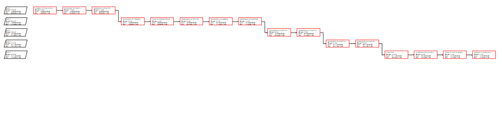
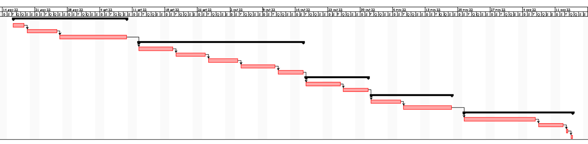
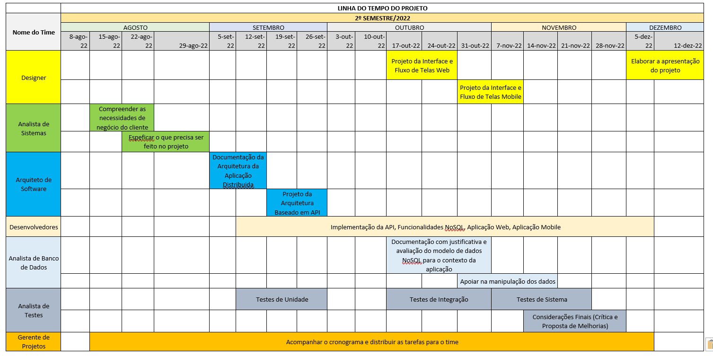

# Especificações do Projeto

Pré-requisitos: <a href="1-Documentação de Contexto.md"> Documentação de Contexto</a>

O propósito de desenvolver esse aplicativo partiu do pressuposto de como e dificil manter a organizado do cartão de vacinação dos nossos pets.sendo que todos os dados estão sendo colocado em papel. partindo dai a ideia do desenvolvimento do aplicativo sendo que hoje todos temos um smartphone , pode facilitar muito a organização das vacinas e demais necessidades dos nossos queridos. 

## Personas

## Histórias de Usuários

|EU COMO... `PERSONA`| QUERO/PRECISO ... `FUNCIONALIDADE` | DÚVIDAS |PARA ... `MOTIVO/VALOR`                 |
|--------------------|------------------------------------|---------|----------------------------------------|
| Arthur Cedrick Nobre  | Lembrar quando é qual vacina deu nos seus animais  | Quando tomar a vacina o comprovante vai direto para o App? ou vou ter que manter o comprovante guardado? | Centralizar registro de vacina e vermífugos ministrados ao pet.  |
| Priscila Moana  | Centralizar as informações dos seus cães  | Por ter uma carreira em ascendência, tem pouco tempo para cuidar dos seus pets  | Unificação e lembrete de vacinar e vermífugar seus cães  |
| Esmeralda Rosa Silva  | Centralizar as informações | Pouco tempo e baixo conhecimento em app móveis  | Ampliar oferta de serviços da sua clínica e ter contato com os seguidores. |
| Eliane Santos | Desejo que todos os animais não tenha uma vida sofrida. | Como gerenciar todos os animais de ruas ?  | Ter um melhor gerenciamento dos animais de ruas em um só lugar |
| Marcos Teixeira  | Eliminar papeis do seu sitio  | Com poucas habilidade em smartphone vou conseguir utilizar ?   | Quero ter um controle melhor dos meus animais da fazenda   |
| Higor Vinicius  | Poder ter as informações em um lugar mais fácil | Vou saber os dias de campanha de vacinação? | Para os meus pets ter uma vida mais saudável   |
| Luiza Cristina  |                                        |                                          |                                                         |
| Gustavo Souza  |                                             |                                            |                                                   |
| Ricardo Oliveira  |                                             |                                               |                                             |

## Modelagem do Processo de Negócio 

### Análise da Situação Atual

Apresente aqui os problemas existentes que viabilizam sua proposta. Apresente o modelo do sistema como ele funciona hoje. Caso sua proposta seja inovadora e não existam processos claramente definidos, apresente como as tarefas que o seu sistema pretende implementar são executadas atualmente, mesmo que não se utilize tecnologia computacional. 

### Descrição Geral da Proposta

Apresente aqui uma descrição da sua proposta abordando seus limites e suas ligações com as estratégias e objetivos do negócio. Apresente aqui as oportunidades de melhorias.

### Processo 1 – NOME DO PROCESSO

Apresente aqui o nome e as oportunidades de melhorias para o processo 1. Em seguida, apresente o modelo do processo 1, descrito no padrão BPMN. 

### Processo 2 – NOME DO PROCESSO

Apresente aqui o nome e as oportunidades de melhorias para o processo 2. Em seguida, apresente o modelo do processo 2, descrito no padrão BPMN.

## Indicadores de Desempenho

Apresente aqui os principais indicadores de desempenho e algumas metas para o processo. Atenção: as informações necessárias para gerar os indicadores devem estar contempladas no diagrama de classe. Colocar no mínimo 5 indicadores. 

Usar o seguinte modelo: 

Obs.: todas as informações para gerar os indicadores devem estar no diagrama de classe a ser apresentado a posteriori. 

## Requisitos

O escopo funcional do projeto é definido por meio dos requisitos funcionais que descrevem as possibilidades interação dos usuários, bem como os requisitos não funcionais que descrevem os aspectos que o sistema deverá apresentar de maneira geral. Estes requisitos são apresentados a seguir.

### Requisitos Funcionais

A tabela 02 a seguir apresenta os requisitos do projeto, identificando a prioridade em que os mesmos devem ser entregues. 

Tabela 02: descrição dos requisitos funcionais. 

|ID    | Descrição do Requisito  | Prioridade |
|------|-----------------------------------------|----|
|RF-001| A aplicação deve permitir ao usuário se cadastrar com e-mail e senha.  | ALTA | 
|RF-002| A aplicação deve permitir ao usuário fazer login, resgatando as informações salvas na conta.   | ALTA |
|RF-003| A aplicação deve permitir ao usuário registrar até 4 animais de estimação para acompanhamento das vacinas e vermífugos.    | ALTA |
|RF-004| A aplicação deve permitir ao usuário registrar no cadastro de cada pet as vacinas e vermífugos tomados por ele.    | ALTA |
|RF-005| A aplicação deve mostrar uma lista pré-selecionada de vacinas para registro.    | MÉDIA |
|RF-006| O app deve mostrar os pets cadastrados na tela inicial.    | MÉDIA |

### Requisitos não Funcionais

A tabela 03 a seguir apresenta os requisitos não funcionais que o projeto deverá atender. 

Tabela 03: descrição dos requisitos não funcionais.

|ID     | Descrição do Requisito  |Prioridade |
|-------|-------------------------|----|
|RNF-001| O aplicativo deverá ser responsivo, permitindo a visualização em um celular de forma adequada.  | MÉDIA | 
|RNF-002| A aplicação deve ser compatível com as últimas versões dos sistemas operacionais do Android e IOS.  |  ALTA |
|RNF-003| O aplicativo deverá ter uma fonte padrão para todas as escritas, com alterações apenas no tamanho.   |  MÉDIA |
|RNF-004| O aplicativo deverá apresentar um layout padrão para todas as telas, podendo ser criado ou utilizado um existente.   |  MÉDIA |

## Restrições

As questões que limitam a execução desse projeto e que se configuram como obrigações claras para o desenvolvimento do projeto em questão são apresentadas na tabela 04 a seguir. 

Tabela 04: descrição das restrições.

|ID| Restrição                                             |
|--|-------------------------------------------------------|
|01| A equipe não pode subcontratar o desenvolvimento do trabalho.  |

Enumere as restrições à sua solução. Lembre-se de que as restrições geralmente limitam a solução candidata.

> **Links Úteis**:
> - [O que são Requisitos Funcionais e Requisitos Não Funcionais?](https://codificar.com.br/requisitos-funcionais-nao-funcionais/)
> - [O que são requisitos funcionais e requisitos não funcionais?](https://analisederequisitos.com.br/requisitos-funcionais-e-requisitos-nao-funcionais-o-que-sao/)

## Diagrama de Casos de Uso

| Ator | Descrição |
|------|-----------|
|Usuário | Pessoa interessada em ter maior controle sobre a vacinação dos seus pets; |
|Sistema | A aplicação em si deve armazenar e buscar informações dos usuários, de seus pets e de vacinas comuns; |

|Caso de Uso | Descrição | RF |
|------------|-----------|----|
| Cadastrar-se na aplicação | O usuário deve conseguir criar uma conta no aplicativo | RF-001 |
| Fazer login | O usuário deve conseguir acessar a aplicação com suas credenciais cadastradas | RF-002 |
| Cadastrar seus pets | O usuário deve conseguir cadastrar até 4 animais de estimação em sua conta para acompanhamento | RF-003 |
| Registrar vacinas / vermífugos | O usuário deve conseguir adicionar no registro de cada pet as vacinas e vermífugos que foram tomados por ele | RF-004 |
| Apresentar lista pré-selecionada de vacinas | No caso do registro de vacinas, a aplicação deve mostrar uma lista de sugestões para inclusão | RF-005 |
| Mostrar pets cadastrados | A aplicação deve mostrar os animais de estimação cadastrados pelo usuário na tela inicial | RF-006 |

- [Representação Visual dos Casos de Uso](https://lucid.app/lucidchart/816ae4ee-c6c9-4843-ba29-98fa866eefea/edit?beaconFlowId=828B05AF4D09364F&invitationId=inv_f2a6041a-68ae-40e1-8c3f-b60b8b3cf130&page=0_0)

> **Links Úteis**:
> - [Criando Casos de Uso](https://www.ibm.com/docs/pt-br/elm/6.0?topic=requirements-creating-use-cases)
> - [Como Criar Diagrama de Caso de Uso: Tutorial Passo a Passo](https://gitmind.com/pt/fazer-diagrama-de-caso-uso.html/)
> - [Lucidchart](https://www.lucidchart.com/)
> - [Astah](https://astah.net/)
> - [Diagrams](https://app.diagrams.net/)

# Matriz de Rastreabilidade

A matriz de rastreabilidade é uma ferramenta usada para facilitar a visualização dos relacionamento entre requisitos e outros artefatos ou objetos, permitindo a rastreabilidade entre os requisitos e os objetivos de negócio. 

A matriz deve contemplar todos os elementos relevantes que fazem parte do sistema, conforme a figura meramente ilustrativa apresentada a seguir.

******************  **REQUISITOS FUNCIONAIS**  **************** **REQUISITOS NÃO FUNCIONAIS**   ****** **CASOS DE USO** ***********************        
|          |RF-001|RF-002|RF-003|RF-004|RF-005|RF-006|RNF-001|RNF-002|RNF-003|RNF-004|UC-1|UC-2|UC-3|UC-4|UC-5|UC-6|UC-7|
|----------|------|------|------|------|------|------|-------|-------|-------|-------|----|----|----|----|----|----|----|
| Usuários |  X   |  X   |  X   |  X   |      |      |       |       |       |       |    |    |    |    |    |    |    | 
| Sistema  |      |      |      |      |  X   |  X   |       |       |       |       |    |    |    |    |    |    |    |
|  RF-001  |      |      |      |      |      |      |  X    |  X    |  X    |  X    |  X |    |    |    |    |    |    |
|  RF-002  |      |      |      |      |      |      |  X    |  X    |  X    |  X    |    | X  |    |    |    |    |    |
|  RF-003  |      |      |      |      |      |      |  X    |  X    |  X    |  X    |    |    |  X |    |    |    |    |
|  RF-004  |      |      |      |      |      |      |  X    |  X    |  X    |  X    |    |    |    | X  | X  |    |    |
|  RF-005  |      |      |      |      |      |      |  X    |  X    |  X    |  X    |    |    |    |    |    |  X |    |
|  RF-006  |      |      |      |      |      |      |  X    |  X    |  X    |  X    |    |    |    |    |    |    | X  |

> **Links Úteis**:
> - [Artigo Engenharia de Software 13 - Rastreabilidade](https://www.devmedia.com.br/artigo-engenharia-de-software-13-rastreabilidade/12822/)
> - [Verificação da rastreabilidade de requisitos usando a integração do IBM Rational RequisitePro e do IBM ClearQuest Test Manager](https://developer.ibm.com/br/tutorials/requirementstraceabilityverificationusingrrpandcctm/)
> - [IBM Engineering Lifecycle Optimization – Publishing](https://www.ibm.com/br-pt/products/engineering-lifecycle-optimization/publishing/)

# Gerenciamento de Projeto

De acordo com o PMBoK v6 as dez áreas que constituem os pilares para gerenciar projetos, e que caracterizam a multidisciplinaridade envolvida, são: Integração, Escopo, Cronograma (Tempo), Custos, Qualidade, Recursos, Comunicações, Riscos, Aquisições, Partes Interessadas. Para desenvolver projetos um profissional deve se preocupar em gerenciar todas essas dez áreas. Elas se complementam e se relacionam, de tal forma que não se deve apenas examinar uma área de forma estanque. É preciso considerar, por exemplo, que as áreas de Escopo, Cronograma e Custos estão muito relacionadas. Assim, se eu amplio o escopo de um projeto eu posso afetar seu cronograma e seus custos.

## Gerenciamento de Tempo

Para elaboração do cronograma do projeto adotamos a técnica PERT – Programa Evaluation Review Technique em conjunto com o método CPM – Critical Path Method, que nos auxiliou a estimar através da experiência em outros projetos já realizados anteriormente e, de forma estatística, o tempo necessário para a realização do desenvolvimento desta nova aplicação. Já sabemos de antemão as tarefas a serem desenvolvidas em cada uma das etapas e baseado nessas iremos determinar o cronograma de tempo. Uma das vantagens que enxergamos com o uso desses dois recursos foram estabelecer os prazos para que cada uma das etapas do projeto seja entregue dentro do prazo firmado, ter uma visão detalhada do que teremos que fazer em cada etapa de forma sequencial e saber distinguir e priorizar as tarefas críticas do projeto. Baseado nisso, poderemos administrar melhor o tempo e minimizar todo e qualquer desperdício de tempo para que possamos concluir todo o projeto no prazo final. 

| Atividades | Descrição | Tempo (dias) | Atividades Precedentes | Atividades Subsequentes |
|------------|-----------|--------------|------------------------|-------------------------|
|     A      | Concepção do Projeto (Fórum para formação do grupo, Brainstorming para discussão e proposição do tema da aplicação a ser desenvolvida). |   3   |  -  |   B   |
|     B      | Documentação de Contexto (Contexto, Problema, Objetivos, Justificativa, Público-alvo).  |   5   |  A  |   C   |
|     C      | Especificações do Projeto (Personas, Histórias de Usuários, Requisitos, Restrições, Diagrama de Casos de Uso, Matriz de Rastreabilidade, Gerenciamento de Projeto).  |   11  |  B  |   D   |
|     D      | Documentação da Arquitetura da Aplicação Distribuída.  |   6   |  C  |   E   |
|     E      | Projeto da Arquitetura Baseada em API.  |   5   |  D  |   F   |
|     F      | Implementação da API e Testes de Unidade.  |   5   |  E  |   G   |
|     G      | Documentação com justificativa e avaliação do modelo de dados NoSQL para o contexto da aplicação.  |   6   |  F  |   H   |
|     H      | Implementação das funcionalidades que envolvem o banco de dados NoSQL para armazenamento e recuperação de dados.  |   4   |  G  |   I   |
|     I      | Documentação do projeto de interface e do fluxo de telas do sistema de uma aplicação web.  |   6   |  H  |   J   |
|     J      | Implementação do projeto de interface, fluxo de telas do sistema de uma aplicação web e testes de integração.  |   4   |  I  |   K   |
|     K      | Documentação do projeto de interface e do fluxo de telas do sistema de uma aplicação mobile.  |   5   |  J  |   L   |
|     L      | Implementação do projeto de interface, fluxo de telas do sistema de uma aplicação mobile e testes de sistema.  |   9   |  K  |   M   |
|     M      | Projeto Final.  |   12  |  L  |   N   |
|     N      | Considerações Finais (Avaliação dos Frameworks e tecnologias utilizadas, Análise Crítica e Proposta de Melhorias).  |   4   |  M  |   O   |
|     O      | Entrega do Vídeo da Apresentação Final e PDF usado na Apresentação.  |   1   |  N  |   P   |
|     P      | Realização da Apresentação Final.  |   1   |  O  |   -   |

Para construção do Gráfico de Gantt e do Diagramas de Rede (método francês) utilizamos o software Project Libre.

O gráfico de Gantt ou diagrama de Gantt também é uma ferramenta visual utilizada para controlar e gerenciar o cronograma de atividades de um projeto. Com ele, é possível listar tudo que precisa ser feito para colocar o projeto em prática, dividir em atividades e estimar o tempo necessário para executá-las.

## Gerenciamento de Equipe

O gerenciamento adequado de tarefas contribuirá para que o projeto alcance altos níveis de produtividade. Por isso, é fundamental que ocorra a gestão de tarefas e de pessoas, de modo que os times envolvidos no projeto possam ser facilmente gerenciados. 

## Gestão de Orçamento

O processo de determinar o custo do projeto é uma tarefa que depende, além dos produtos (saídas) dos processos anteriores do gerenciamento de custos, também de produtos oferecidos por outros processos de gerenciamento, como o escopo e o tempo.

************** **ORÇAMENTO** ********************
| **RECURSOS** | **QUANTIDADE** | **VALOR (R$)** |
|--------------|----------------|----------------|
| Recursos Humanos | 07 | R$ 21.000,00 |
| Hardware | 07 | R$ 8.750,00 |
| Rede | 07 | R$ 3.500,00 |
| Softwares | 07 | R$ 700,00 |
| Serviços  | 07 | R$ 1.750,00 |
| **TOTAL**| | **R$ 35.200,00** |

Memória de Cálculo: 

Recursos Humanos = 7 pessoas x R$ 50,00/Hora x 60 Horas = R$ 21.000,00 

Hardware = locação 7 Notebooks x R$ 250,00/Mês x 5 Meses = R$ 8.750,00 

Rede = 7 internet banda larga x R$ 100,00/Mês x 5 Meses = R$ 3.000,00 

Softwares = locação de 7 (windows, office) x R$ 20,00/Mês x 5 Meses = R$ 700,00 

Serviços = 7 despesas (energia, hospedagem) x R$ 50,00/Mês x 5 Meses = R$ 1.750,00 

 
